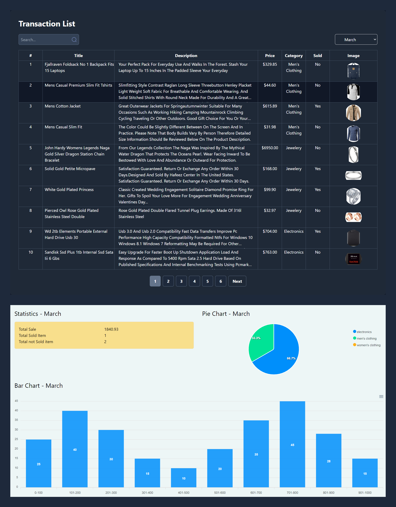

# MERN Stack Coding Challenge Documentation

## Overview

This project is a full-stack application developed using the MERN (MongoDB, Express.js, React.js, Node.js) stack. It includes both backend and frontend components to handle transactions data from a third-party API, provide various functionalities such as listing transactions, generating statistics, bar chart, pie chart, and displaying them in a user-friendly web interface.

## Backend

### Initialization API

- **Endpoint:** `/api/v1/product/initialize-seed-data`
- **Method:** GET
- **Description:** Initializes the database by fetching data from the third-party API (`https://s3.amazonaws.com/roxiler.com/product_transaction.json`) and seeding the database with the obtained data.

### List Products API

- **Endpoint:** `/api/v1/product`
- **Method:** GET
- **Parameters:**
  - `month` (string): The month for which transactions need to be fetched.
  - `page` (integer, optional): Page number for pagination (default: 1).
  - `perPage` (integer, optional): Number of items per page for pagination (default: 10).
  - `search` (string, optional): Search text to filter transactions based on title/description/price.

### Statistics API

- **Endpoint:** `/api/v1/analytics/statistics`
- **Method:** GET
- **Parameters:**
  - `month` (string): The month for which statistics need to be fetched.

### Bar Chart API

- **Endpoint:** `/api/v1/analytics/bar-chart`
- **Method:** GET
- **Parameters:**
  - `month` (string): The month for which bar chart data needs to be fetched.

### Pie Chart API

- **Endpoint:** `/api/v1/analytics/pie-chart`
- **Method:** GET
- **Parameters:**
  - `month` (string): The month for which pie chart data needs to be fetched.

### Combined API

- **Endpoint:** `/api/v1/analytics/combined-chart`
- **Method:** GET
- **Description:** Fetches data from all the above APIs, combines the response, and sends a final JSON response.

## Frontend

### Transactions Table

- Displays a table of transactions with the following features:
  - Month selection dropdown (Jan to Dec) to filter transactions by month.
  - Default selection: March.
  - Search box to filter transactions based on title/description/price.
  - Pagination with Next and Previous buttons.

### Transactions Statistics

- Displays total amount of sale, total sold items, and total not sold items for the selected month.

### Transactions Bar Chart

- Displays a bar chart showing the price range and the number of items in each range for the selected month.

